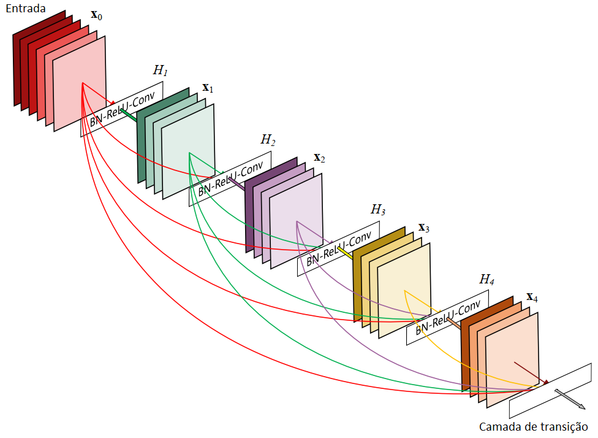

##  Age range estimation based on CNN DenseNet201
- This project represents my undergraduate final work, whose main objective was to realize age range estimation based on a convolutional neural network. As data, the recognition process occurred with cropped face images.
- About main files in the repository:
	 - Full dissertation (portuguese) with all the theorical and technical details: [TCC.pdf](https://github.com/LeAmSa/Age-Estimation-DenseNet/blob/master/TCC.pdf "TCC.pdf").
	 - Full notebook with all code steps:  [AgeRangeEstimationDenseNet.ipynb](https://github.com/LeAmSa/Age-Estimation-DenseNet/blob/master/AgeRangeEstimationDenseNet.ipynb "AgeRangeEstimationDenseNet.ipynb").
	 - Script for model customization: [model_customization.py](https://github.com/LeAmSa/Age-Estimation-DenseNet/blob/master/scripts/model_customization.py "model_customization.py").
	 - Script for training process: [train.py](https://github.com/LeAmSa/Age-Estimation-DenseNet/blob/master/scripts/train.py "train.py").

### Dataset

- The dataset used to train the neural network was __UTKFace Dataset__, made for research based on age, gender, and race.
- Files format: ``[age]_[gender]_[race]_[date&time].jpg``
	- `[age]:` integer from 0 to 116, indicating the age;
	- `[gender]:` 0 (male) or 1 (female);
	- `[race]:` integer from 0 to 4, denoting White, Black, Asian, Indian, and Others (like Hispanic, Latino, Middle Eastern);
	- `[date&time]:` format of yyyymmddHHMMSSFFF, showing the date and time an image was collected to UTKFace.
- As the dataset is very large, I provide some sample files in [img](https://github.com/LeAmSa/Age-Estimation-DenseNet/tree/master/img "img") folder.
- The UTKFace Dataset can be downloaded [here](https://susanqq.github.io/UTKFace/).

### CNN model
- The CNN chosen for the training process was DenseNet201.
- Below, a dense layer structure example:

### Experiments
- I nominated three experiments for classification model:
  - Exp 1: classification in 7 age ranges: ‘1–10’, ‘11–15’, ‘16–18’, ‘19–25’, ‘26–40’, ‘41–60’, ‘61–116’;
  - Exp 2: classification in 4 age ranges: ‘1–12’, ‘13–17’, ‘18–35’, ‘36–116’;
  - Exp 3: classification in 2 age ranges: ‘1–17’, ‘18–116’.

### Results
- Were tested many configurations to find the best accuracy. The table below shows the most suitable ones.

|Hyperparameter| Value |
|--|--|
| Loss Function | Categorical Crossentropy |
| Dropout Keep Probability | 0.5 |
| Batch Size | 32 |
| Learning Rate | 0.001(Exp 1) 0.0001(Exp 2 and 3) |
- For the proposed experiments, these were the accuracy values: 

|Experiment| Accuracy |
|--|--|
| 1 | 62.00% |
| 2 | 73.00% |
| 3 | 96.85% |

