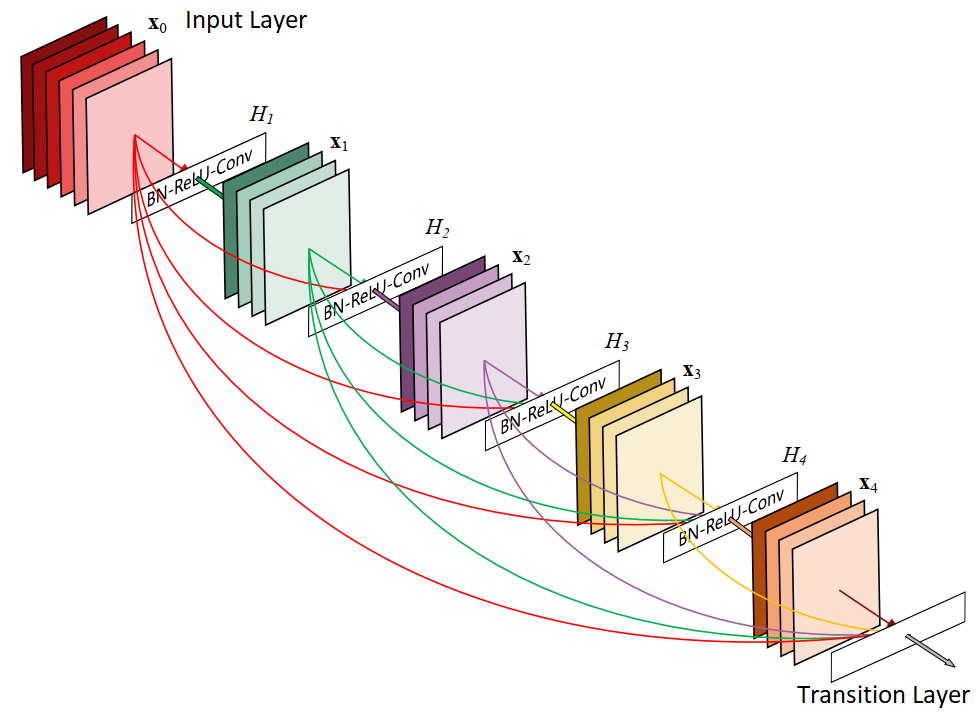

##  Age range estimation using CNN DenseNet201
- This project was made as my undergraduate final work. The main objective was to realize range age estimation using convolutional neural network. The recognition process occured based on cropped face images.
- About main files in the repository:
	 - Full dissertation (portuguese) with all the theorical and technical details: [TCC.pdf](https://github.com/LeAmSa/Age-Estimation-DenseNet/blob/master/TCC.pdf "TCC.pdf").
	 - Full notebook with all the code steps:  [DenseNet_Classification.ipynb](https://github.com/LeAmSa/Age-Estimation-DenseNet/blob/master/DenseNet_Classification.ipynb "DenseNet_Classification.ipynb").
	 - Script for model customization: [model_customization.py](https://github.com/LeAmSa/Age-Estimation-DenseNet/blob/master/scripts/model_customization.py "model_customization.py").
	 - Script for training process: [train.py](https://github.com/LeAmSa/Age-Estimation-DenseNet/blob/master/scripts/train.py "train.py").

### Dataset

- To train the neural network was used the face image public dataset __UTKFace Dataset__, made for researchs based on age, gender and race.
- Files format: ``[age]_[gender]_[race]_[date&time].jpg``
	- `[age]:` integer from 0 to 116, indicating the age;
	- `[gender]:` 0 (male) or 1 (female);
	- `[race]:` integer from 0 to 4, denoting White, Black, Asian, Indian, and Others (like Hispanic, Latino, Middle Eastern);
	- `[date&time]:` format of yyyymmddHHMMSSFFF, showing the date and time an image was collected to UTKFace.
- As the dataset is very large, I provide some sample files in [img](https://github.com/LeAmSa/Age-Estimation-DenseNet/tree/master/img "img") folder.
- The UTKFace Dataset can be downloaded [here](https://susanqq.github.io/UTKFace/).

### CNN model
- The CNN chosed for training process was DenseNet201.
- Bellow, a dense layer structure example:

### Experiments
- I proposed three experiments for classification model:
  - Exp 1: classificate in 7 age ranges: ‘1–10’, ‘11–15’, ‘16–18’, ‘19–25’, ‘26–40’, ‘41–60’, ‘61–116’;
  - Exp 2: classificate in 4 age ranges: ‘1–12’, ‘13–17’, ‘18–35’, ‘36–116’;
  - Exp 3: classificate in 2 age ranges: ‘1–17’, ‘18–116’.

### Results
- To find the best accuracy, many configurations were tested, the most suitable ones being represented by the table below:

|Hyperparameter| Value |
|--|--|
| Loss Function | Categorical Crossentropy |
| Dropout Keep Probability | 0.5 |
| Batch Size | 32 |
| Learning Rate | 0.001(Exp 1) 0.0001(Exp 2 and 3) |
- For the proposed experiments, these were the accuracy values: 

|Experiment| Accuracy |
|--|--|
| 1 | 60.9% |
| 2 | 82.67% |
| 3 | 95.9% |

